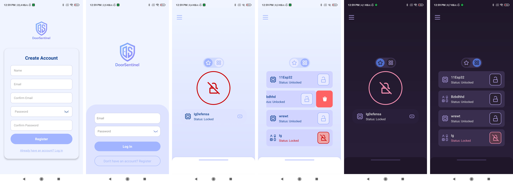

# DoorSentinel

## 📝 Descripción  
Aplicación móvil de seguridad desarrollada con **React Native** y **TypeScript** (usando Expo), que permite el monitoreo en tiempo real de la apertura y cierre de puertas mediante dispositivos ESP32 conectados a un servidor personalizado.

## 📸 Capturas  

  
*Pantalla inicial de la aplicación con opciones de login y registro.*  
*Listado de dispositivos conectados y su estado (bloqueado/desbloqueado). Compatible con modo oscuro y claro.*

## 📖 Descripción Detallada  
**DoorSentinel** es una aplicación centrada en el monitoreo y control de accesos en tiempo real.  

- Desarrollada con **React Native y TypeScript**, usando **Expo** para simplificar la construcción y despliegue de la app.  
- Se conecta a **dispositivos ESP32** que detectan la apertura y cierre de puertas.  
- Cuando se detecta un evento, el **ESP32** envía una señal al servidor **[backend](https://github.com/TeurDev/DoorSentinel-Backend)**, desarrollado con **Node.js**.  
- El backend gestiona la lógica, se conecta a la base de datos **MongoDB** (NoSQL) y envía notificaciones push a la app móvil.  
- El frontend se centra en la visualización: permite registro de usuarios, gestión de dispositivos, creación de grupos de dispositivos y alertas inmediatas.  

### 🔧 Tecnologías Principales
- **Frontend:** React Native + TypeScript + Expo  
- **[Backend](https://github.com/TeurDev/DoorSentinel-Backend):** Node.js + Express  
- **Base de datos:** MongoDB  
- **Dispositivos IoT:** ESP32  
- **Notificaciones Push:** Integradas vía Expo y servidor personalizado  

En resumen, el **frontend (DoorSentinel)** no realiza cálculos complejos; sirve como interfaz para interactuar con el sistema. La lógica principal y la gestión de datos residen en el **[backend](https://github.com/TeurDev/DoorSentinel-Backend)**.

---
